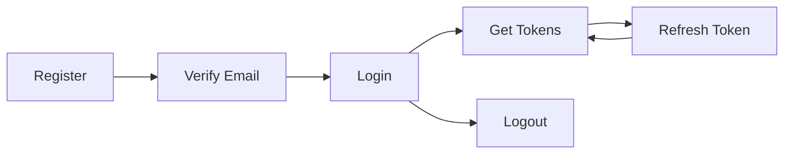
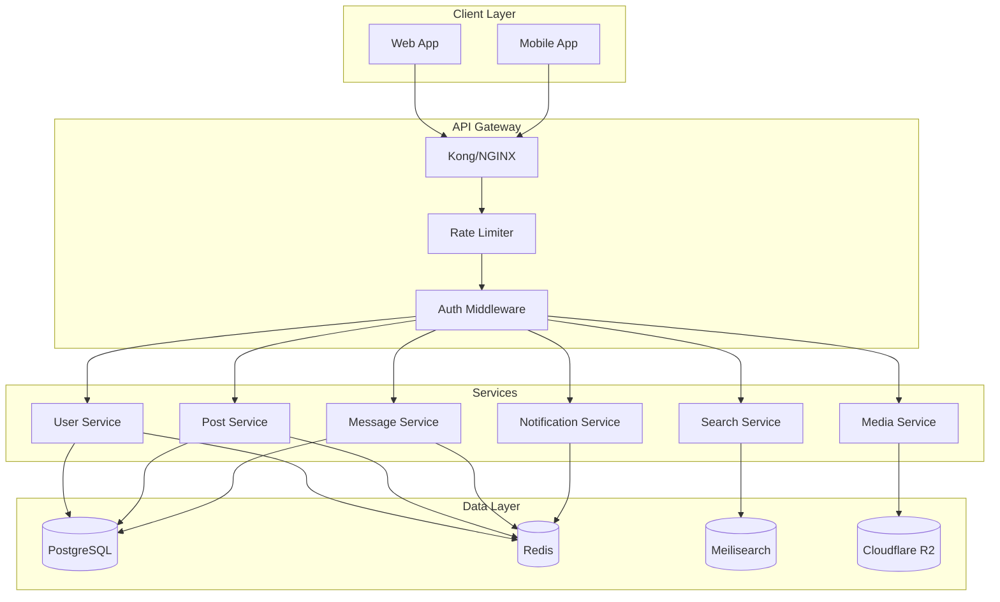

# SalamHub API Architecture

## Overview

This document defines the RESTful API architecture for SalamHub, including all endpoints, authentication, and data formats.

---

## API Design Principles

1. **RESTful Design**: Resource-based URLs with proper HTTP methods
2. **Versioning**: URL-based versioning (`/api/v1/`)
3. **Authentication**: JWT-based with refresh tokens
4. **Rate Limiting**: Tiered limits based on user role
5. **Response Format**: Consistent JSON structure
6. **Error Handling**: Standardized error codes and messages
7. **Localization**: Arabic-first with language negotiation

---

## Base URL Structure

```
Production:    https://api.salamhub.com/v1
Development:   http://localhost:3000/api/v1
```

---

## Authentication

### JWT Token Structure

```typescript
interface JWTPayload {
  userId: string;
  email: string;
  role: 'USER' | 'MODERATOR' | 'ADMIN' | 'SUPER_ADMIN';
  iat: number;
  exp: number;
}
```

### Token Types

| Token Type | Expiry | Purpose |
|------------|--------|---------|
| Access Token | 15 minutes | API authentication |
| Refresh Token | 7 days | Token renewal |
| Email Verification | 24 hours | Account verification |
| Password Reset | 1 hour | Password recovery |

### Headers

```
Authorization: Bearer <access_token>
Content-Type: application/json
Accept-Language: ar | en
X-Request-ID: <uuid>
```

---

## Response Format

### Success Response

```json
{
  "success": true,
  "data": { ... },
  "meta": {
    "page": 1,
    "limit": 20,
    "total": 100,
    "hasMore": true
  }
}
```

### Error Response

```json
{
  "success": false,
  "error": {
    "code": "VALIDATION_ERROR",
    "message": "Invalid input data",
    "details": [
      {
        "field": "email",
        "message": "Invalid email format"
      }
    ]
  }
}
```

---

## API Endpoints

### 1. Authentication Endpoints



| Method | Endpoint | Description | Auth |
|--------|----------|-------------|------|
| POST | `/auth/register` | Register new user | No |
| POST | `/auth/verify-email` | Verify email address | No |
| POST | `/auth/login` | Login user | No |
| POST | `/auth/logout` | Logout user | Yes |
| POST | `/auth/refresh` | Refresh access token | No |
| POST | `/auth/forgot-password` | Request password reset | No |
| POST | `/auth/reset-password` | Reset password | No |

#### POST /auth/register

**Request Body:**
```json
{
  "email": "user@example.com",
  "username": "johndoe",
  "password": "SecurePass123!",
  "displayName": "John Doe",
  "language": "ar"
}
```

**Response:**
```json
{
  "success": true,
  "data": {
    "message": "Verification email sent",
    "userId": "clx123..."
  }
}
```

#### POST /auth/login

**Request Body:**
```json
{
  "email": "user@example.com",
  "password": "SecurePass123!"
}
```

**Response:**
```json
{
  "success": true,
  "data": {
    "user": {
      "id": "clx123...",
      "email": "user@example.com",
      "username": "johndoe",
      "displayName": "John Doe",
      "avatar": "https://...",
      "isVerified": true
    },
    "tokens": {
      "accessToken": "eyJ...",
      "refreshToken": "eyJ...",
      "expiresIn": 900
    }
  }
}
```

---

### 2. User Endpoints

| Method | Endpoint | Description | Auth |
|--------|----------|-------------|------|
| GET | `/users/me` | Get current user | Yes |
| PATCH | `/users/me` | Update current user | Yes |
| GET | `/users/:id` | Get user by ID | Yes |
| GET | `/users/:id/posts` | Get user posts | Yes |
| GET | `/users/:id/followers` | Get user followers | Yes |
| GET | `/users/:id/following` | Get user following | Yes |
| POST | `/users/:id/follow` | Follow user | Yes |
| DELETE | `/users/:id/follow` | Unfollow user | Yes |
| GET | `/users/search` | Search users | Yes |

#### GET /users/me

**Response:**
```json
{
  "success": true,
  "data": {
    "id": "clx123...",
    "email": "user@example.com",
    "username": "johndoe",
    "displayName": "John Doe",
    "bio": "Software developer",
    "avatar": "https://...",
    "coverImage": "https://...",
    "location": "Cairo, Egypt",
    "website": "https://johndoe.com",
    "isVerified": true,
    "isPrivate": false,
    "followersCount": 1500,
    "followingCount": 320,
    "postsCount": 45,
    "createdAt": "2024-01-15T10:30:00Z"
  }
}
```

#### PATCH /users/me

**Request Body:**
```json
{
  "displayName": "John Updated",
  "bio": "Updated bio",
  "location": "Riyadh, Saudi Arabia"
}
```

---

### 3. Post Endpoints

| Method | Endpoint | Description | Auth |
|--------|----------|-------------|------|
| POST | `/posts` | Create post | Yes |
| GET | `/posts/:id` | Get single post | Yes |
| DELETE | `/posts/:id` | Delete post | Yes |
| POST | `/posts/:id/repost` | Repost post | Yes |
| DELETE | `/posts/:id/repost` | Remove repost | Yes |
| GET | `/feed` | Get main feed | Yes |
| GET | `/feed/following` | Get following feed | Yes |

#### POST /posts

**Request Body:**
```json
{
  "content": "Hello SalamHub! #FirstPost",
  "media": ["media_id_1", "media_id_2"],
  "visibility": "PUBLIC",
  "groupId": null
}
```

**Response:**
```json
{
  "success": true,
  "data": {
    "id": "post123...",
    "content": "Hello SalamHub! #FirstPost",
    "author": {
      "id": "clx123...",
      "username": "johndoe",
      "displayName": "John Doe",
      "avatar": "https://..."
    },
    "media": [
      {
        "id": "media1",
        "url": "https://...",
        "type": "IMAGE"
      }
    ],
    "hashtags": ["FirstPost"],
    "likeCount": 0,
    "commentCount": 0,
    "repostCount": 0,
    "createdAt": "2024-01-15T10:30:00Z"
  }
}
```

#### GET /feed

**Query Parameters:**
- `page` (number): Page number (default: 1)
- `limit` (number): Items per page (default: 20, max: 50)
- `type` (string): Feed type - `algorithmic` | `chronological`

**Response:**
```json
{
  "success": true,
  "data": [
    {
      "id": "post123...",
      "content": "Post content...",
      "author": { ... },
      "media": [ ... ],
      "likeCount": 45,
      "commentCount": 12,
      "repostCount": 5,
      "isLiked": false,
      "isBookmarked": false,
      "createdAt": "2024-01-15T10:30:00Z"
    }
  ],
  "meta": {
    "page": 1,
    "limit": 20,
    "total": 150,
    "hasMore": true
  }
}
```

---

### 4. Comment Endpoints

| Method | Endpoint | Description | Auth |
|--------|----------|-------------|------|
| POST | `/posts/:id/comments` | Create comment | Yes |
| GET | `/posts/:id/comments` | Get post comments | Yes |
| GET | `/comments/:id` | Get single comment | Yes |
| DELETE | `/comments/:id` | Delete comment | Yes |
| POST | `/comments/:id/reply` | Reply to comment | Yes |

#### POST /posts/:id/comments

**Request Body:**
```json
{
  "content": "Great post!",
  "parentId": null
}
```

---

### 5. Like/Reaction Endpoints

| Method | Endpoint | Description | Auth |
|--------|----------|-------------|------|
| POST | `/posts/:id/like` | Like post | Yes |
| DELETE | `/posts/:id/like` | Unlike post | Yes |
| POST | `/posts/:id/react` | React to post | Yes |
| POST | `/comments/:id/like` | Like comment | Yes |
| DELETE | `/comments/:id/like` | Unlike comment | Yes |

#### POST /posts/:id/react

**Request Body:**
```json
{
  "type": "SUBHANALLAH"
}
```

---

### 6. Media Endpoints

| Method | Endpoint | Description | Auth |
|--------|----------|-------------|------|
| POST | `/media/upload` | Upload media | Yes |
| GET | `/media/:id` | Get media info | Yes |
| DELETE | `/media/:id` | Delete media | Yes |

#### POST /media/upload

**Request:** `multipart/form-data`
- `file`: The media file
- `altText`: Alternative text for accessibility

**Response:**
```json
{
  "success": true,
  "data": {
    "id": "media123...",
    "url": "https://storage.salamhub.com/...",
    "thumbnail": "https://storage.salamhub.com/.../thumb",
    "type": "IMAGE",
    "width": 1920,
    "height": 1080,
    "size": 524288
  }
}
```

---

### 7. Messaging Endpoints

| Method | Endpoint | Description | Auth |
|--------|----------|-------------|------|
| GET | `/conversations` | Get user conversations | Yes |
| POST | `/conversations` | Create conversation | Yes |
| GET | `/conversations/:id` | Get conversation | Yes |
| GET | `/conversations/:id/messages` | Get messages | Yes |
| POST | `/conversations/:id/messages` | Send message | Yes |
| POST | `/conversations/:id/read` | Mark as read | Yes |

#### POST /conversations

**Request Body:**
```json
{
  "type": "DIRECT",
  "participantIds": ["user456..."]
}
```

#### POST /conversations/:id/messages

**Request Body:**
```json
{
  "content": "Encrypted message content...",
  "type": "TEXT",
  "encryptionKey": "key_reference"
}
```

---

### 8. Notification Endpoints

| Method | Endpoint | Description | Auth |
|--------|----------|-------------|------|
| GET | `/notifications` | Get notifications | Yes |
| POST | `/notifications/:id/read` | Mark as read | Yes |
| POST | `/notifications/read-all` | Mark all as read | Yes |

---

### 9. Group Endpoints

| Method | Endpoint | Description | Auth |
|--------|----------|-------------|------|
| GET | `/groups` | Get groups | Yes |
| POST | `/groups` | Create group | Yes |
| GET | `/groups/:id` | Get group | Yes |
| PATCH | `/groups/:id` | Update group | Yes |
| DELETE | `/groups/:id` | Delete group | Yes |
| POST | `/groups/:id/join` | Join group | Yes |
| POST | `/groups/:id/leave` | Leave group | Yes |
| GET | `/groups/:id/members` | Get members | Yes |
| POST | `/groups/:id/members/:userId/role` | Update member role | Yes |

---

### 10. Search Endpoints

| Method | Endpoint | Description | Auth |
|--------|----------|-------------|------|
| GET | `/search` | Global search | Yes |
| GET | `/search/users` | Search users | Yes |
| GET | `/search/posts` | Search posts | Yes |
| GET | `/search/hashtags` | Search hashtags | Yes |
| GET | `/search/groups` | Search groups | Yes |

#### GET /search

**Query Parameters:**
- `q` (string): Search query
- `type` (string): `all` | `users` | `posts` | `hashtags` | `groups`
- `page` (number): Page number
- `limit` (number): Items per page

---

### 11. Moderation Endpoints (Admin/Moderator)

| Method | Endpoint | Description | Auth |
|--------|----------|-------------|------|
| GET | `/moderation/reports` | Get reports | Moderator+ |
| POST | `/reports` | Submit report | Yes |
| PATCH | `/moderation/reports/:id` | Update report status | Moderator+ |
| POST | `/moderation/users/:id/ban` | Ban user | Admin+ |
| DELETE | `/moderation/posts/:id` | Remove post | Moderator+ |

#### POST /reports

**Request Body:**
```json
{
  "postId": "post123...",
  "reason": "INAPPROPRIATE_CONTENT",
  "description": "This post violates community guidelines..."
}
```

---

### 12. Hashtag Endpoints

| Method | Endpoint | Description | Auth |
|--------|----------|-------------|------|
| GET | `/hashtags/:name` | Get hashtag info | Yes |
| GET | `/hashtags/:name/posts` | Get hashtag posts | Yes |
| GET | `/hashtags/trending` | Get trending hashtags | Yes |

---

## WebSocket Events

For real-time features, SalamHub uses WebSocket connections.

### Connection

```
wss://api.salamhub.com/ws
```

### Events

| Event | Direction | Description |
|-------|-----------|-------------|
| `connection` | Client → Server | Authenticate connection |
| `message` | Server → Client | New message received |
| `notification` | Server → Client | New notification |
| `typing` | Client → Server | Typing indicator |
| `typing` | Server → Client | User is typing |
| `post:new` | Server → Client | New post in feed |
| `post:like` | Server → Client | Post liked |
| `presence` | Server → Client | User presence update |

---

## Rate Limiting

| Tier | Requests/Minute | Burst | User Type |
|------|-----------------|-------|-----------|
| Anonymous | 60 | 10 | Unauthenticated |
| Basic | 120 | 20 | Regular user |
| Verified | 300 | 50 | Verified user |
| Premium | 600 | 100 | Premium subscriber |
| Admin | Unlimited | - | Admin roles |

---

## Error Codes

| Code | HTTP Status | Description |
|------|-------------|-------------|
| `VALIDATION_ERROR` | 400 | Invalid input data |
| `UNAUTHORIZED` | 401 | Authentication required |
| `FORBIDDEN` | 403 | Insufficient permissions |
| `NOT_FOUND` | 404 | Resource not found |
| `CONFLICT` | 409 | Resource conflict |
| `RATE_LIMITED` | 429 | Too many requests |
| `INTERNAL_ERROR` | 500 | Server error |

---

## API Architecture Diagram



---

*Document Version: 1.0*
*Created: 2026-02-20*
*Status: Ready for Implementation*