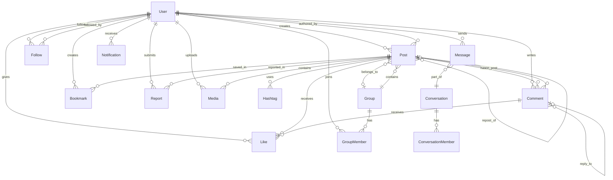

# SalamHub Database Schema Design

## Overview

This document defines the complete database schema for SalamHub, a social media platform with Islamic values foundation. The schema is designed for PostgreSQL with Prisma ORM.

---

## Database Technology

| Component | Technology | Rationale |
|-----------|------------|-----------|
| **Primary Database** | PostgreSQL 15+ | ACID compliance, JSON support, full-text search |
| **ORM** | Prisma | Type-safe, excellent DX, migrations |
| **Caching** | Redis | Sessions, feed caching, real-time features |
| **Search** | Meilisearch | Fast Arabic-aware full-text search |
| **Object Storage** | Cloudflare R2 | Media files, cost-effective |

---

## Schema Diagram



---

## Table Definitions

### 1. Users Table

```prisma
model User {
  id            String    @id @default(cuid())
  email         String    @unique
  phone         String?   @unique
  username      String    @unique
  displayName   String?
  bio           String?   @db.Text
  avatar        String?   // URL to avatar image
  coverImage    String?   // URL to cover image
  website       String?
  location      String?
  birthDate     DateTime?
  isVerified    Boolean   @default(false)
  isPrivate     Boolean   @default(false)
  role          Role      @default(USER)
  language      String    @default("ar")
  createdAt     DateTime  @default(now())
  updatedAt     DateTime  @updatedAt
  lastActiveAt  DateTime?
  
  // Relations
  posts         Post[]
  comments      Comment[]
  likes         Like[]
  followers     Follow[]  @relation("UserFollowers")
  following     Follow[]  @relation("UserFollowing")
  messages      Message[] @relation("MessageSender")
  conversations ConversationMember[]
  notifications Notification[]
  groups        GroupMember[]
  bookmarks     Bookmark[]
  reports       Report[]  @relation("Reporter")
  reportedBy    Report[]  @relation("ReportedUser")
  media         Media[]
  
  @@index([email])
  @@index([username])
  @@index([createdAt])
}

enum Role {
  USER
  MODERATOR
  ADMIN
  SUPER_ADMIN
}
```

### 2. Posts Table

```prisma
model Post {
  id            String    @id @default(cuid())
  content       String?   @db.Text
  authorId      String
  repostOfId    String?   // For reposts
  groupId       String?   // If posted in a group
  replyToId     String?   // For thread replies
  visibility    Visibility @default(PUBLIC)
  isPinned      Boolean   @default(false)
  likeCount     Int       @default(0)
  commentCount  Int       @default(0)
  repostCount   Int       @default(0)
  bookmarkCount Int       @default(0)
  createdAt     DateTime  @default(now())
  updatedAt     DateTime  @updatedAt
  deletedAt     DateTime?
  
  // Relations
  author        User      @relation(fields: [authorId], references: [id])
  repostOf      Post?     @relation("PostRepost", fields: [repostOfId], references: [id])
  reposts       Post[]    @relation("PostRepost")
  group         Group?    @relation(fields: [groupId], references: [id])
  replyTo       Post?     @relation("PostThread", fields: [replyToId], references: [id])
  replies       Post[]    @relation("PostThread")
  media         Media[]
  comments      Comment[]
  likes         Like[]
  hashtags      Hashtag[]
  bookmarks     Bookmark[]
  reports       Report[]
  
  @@index([authorId])
  @@index([createdAt])
  @@index([groupId])
  @@fulltext([content]) // For search
}

enum Visibility {
  PUBLIC
  FOLLOWERS
  MENTIONED
  GROUP
}
```

### 3. Comments Table

```prisma
model Comment {
  id          String    @id @default(cuid())
  content     String    @db.Text
  postId      String
  authorId    String
  parentId    String?   // For threaded replies
  likeCount   Int       @default(0)
  createdAt   DateTime  @default(now())
  updatedAt   DateTime  @updatedAt
  deletedAt   DateTime?
  
  // Relations
  post        Post      @relation(fields: [postId], references: [id])
  author      User      @relation(fields: [authorId], references: [id])
  parent      Comment?  @relation("CommentReplies", fields: [parentId], references: [id])
  replies     Comment[] @relation("CommentReplies")
  likes       Like[]
  
  @@index([postId])
  @@index([authorId])
  @@index([parentId])
}
```

### 4. Likes/Reactions Table

```prisma
model Like {
  id          String    @id @default(cuid())
  userId      String
  postId      String?
  commentId   String?
  type        ReactionType @default(LIKE)
  createdAt   DateTime  @default(now())
  
  // Relations
  user        User      @relation(fields: [userId], references: [id])
  post        Post?     @relation(fields: [postId], references: [id])
  comment     Comment?  @relation(fields: [commentId], references: [id])
  
  @@unique([userId, postId])
  @@unique([userId, commentId])
  @@index([postId])
  @@index([commentId])
}

enum ReactionType {
  LIKE
  LOVE
  CARE
  LAUGH
  SAD
  ANGRY
  SUBHANALLAH    // سبحان الله
  ALHAMDULILLAH  // الحمد لله
  ALLAHU_AKBAR   // الله أكبر
  MASHALLAH      // ما شاء الله
}
```

### 5. Follows Table

```prisma
model Follow {
  id          String    @id @default(cuid())
  followerId  String
  followingId String
  status      FollowStatus @default(ACCEPTED)
  createdAt   DateTime  @default(now())
  
  // Relations
  follower    User      @relation("UserFollowing", fields: [followerId], references: [id])
  following   User      @relation("UserFollowers", fields: [followingId], references: [id])
  
  @@unique([followerId, followingId])
  @@index([followingId])
}

enum FollowStatus {
  PENDING   // For private accounts
  ACCEPTED
  BLOCKED
}
```

### 6. Media Table

```prisma
model Media {
  id          String    @id @default(cuid())
  url         String
  thumbnail   String?
  type        MediaType
  mimeType    String
  size        Int       // in bytes
  width       Int?
  height      Int?
  altText     String?
  postId      String?
  userId      String
  createdAt   DateTime  @default(now())
  
  // Relations
  post        Post?     @relation(fields: [postId], references: [id])
  user        User      @relation(fields: [userId], references: [id])
  
  @@index([postId])
  @@index([userId])
}

enum MediaType {
  IMAGE
  VIDEO
  AUDIO
  DOCUMENT
}
```

### 7. Hashtags Table

```prisma
model Hashtag {
  id          String    @id @default(cuid())
  name        String    @unique
  postId      String
  createdAt   DateTime  @default(now())
  
  // Relations
  post        Post      @relation(fields: [postId], references: [id])
  
  @@index([name])
}
```

### 8. Bookmarks Table

```prisma
model Bookmark {
  id          String    @id @default(cuid())
  userId      String
  postId      String
  createdAt   DateTime  @default(now())
  
  // Relations
  user        User      @relation(fields: [userId], references: [id])
  post        Post      @relation(fields: [postId], references: [id])
  
  @@unique([userId, postId])
}
```

### 9. Groups Table

```prisma
model Group {
  id          String    @id @default(cuid())
  name        String
  description String?   @db.Text
  coverImage  String?
  avatar      String?
  ownerId     String
  visibility  GroupVisibility @default(PUBLIC)
  isVerified  Boolean   @default(false)
  memberCount Int       @default(0)
  postCount   Int       @default(0)
  createdAt   DateTime  @default(now())
  updatedAt   DateTime  @updatedAt
  
  // Relations
  members     GroupMember[]
  posts       Post[]
  
  @@index([visibility])
  @@index([createdAt])
}

enum GroupVisibility {
  PUBLIC
  PRIVATE
  SECRET
}

model GroupMember {
  id          String      @id @default(cuid())
  userId      String
  groupId     String
  role        GroupRole   @default(MEMBER)
  joinedAt    DateTime    @default(now())
  
  // Relations
  user        User        @relation(fields: [userId], references: [id])
  group       Group       @relation(fields: [groupId], references: [id])
  
  @@unique([userId, groupId])
}

enum GroupRole {
  MEMBER
  MODERATOR
  ADMIN
  OWNER
}
```

### 10. Messages/Conversations Tables

```prisma
model Conversation {
  id          String    @id @default(cuid())
  type        ConversationType
  name        String?   // For group conversations
  avatar      String?
  createdAt   DateTime  @default(now())
  updatedAt   DateTime  @updatedAt
  
  // Relations
  members     ConversationMember[]
  messages    Message[]
}

enum ConversationType {
  DIRECT
  GROUP
}

model ConversationMember {
  id              String    @id @default(cuid())
  conversationId  String
  userId          String
  lastReadAt      DateTime?
  joinedAt        DateTime  @default(now())
  
  // Relations
  conversation    Conversation @relation(fields: [conversationId], references: [id])
  user            User        @relation(fields: [userId], references: [id])
  
  @@unique([conversationId, userId])
}

model Message {
  id              String    @id @default(cuid())
  conversationId  String
  senderId        String
  content         String    @db.Text
  type            MessageType @default(TEXT)
  mediaUrl        String?
  isEncrypted     Boolean   @default(true)
  encryptionKey   String?   // E2E encryption key reference
  isRead          Boolean   @default(false)
  createdAt       DateTime  @default(now())
  deletedAt       DateTime?
  
  // Relations
  conversation    Conversation @relation(fields: [conversationId], references: [id])
  sender          User        @relation("MessageSender", fields: [senderId], references: [id])
  
  @@index([conversationId])
  @@index([senderId])
  @@index([createdAt])
}

enum MessageType {
  TEXT
  IMAGE
  VIDEO
  AUDIO
  FILE
  VOICE_NOTE
}
```

### 11. Notifications Table

```prisma
model Notification {
  id          String          @id @default(cuid())
  userId      String
  type        NotificationType
  title       String?
  content     String?
  data        Json?           // Additional data as JSON
  isRead      Boolean         @default(false)
  createdAt   DateTime        @default(now())
  
  // Relations
  user        User            @relation(fields: [userId], references: [id])
  
  @@index([userId])
  @@index([createdAt])
}

enum NotificationType {
  FOLLOW
  LIKE
  COMMENT
  REPOST
  MENTION
  MESSAGE
  GROUP_INVITE
  GROUP_POST
  SYSTEM
}
```

### 12. Reports Table (Content Moderation)

```prisma
model Report {
  id          String      @id @default(cuid())
  reporterId  String
  reportedUserId String?
  postId      String?
  commentId   String?
  reason      ReportReason
  description String?     @db.Text
  status      ReportStatus @default(PENDING)
  reviewedBy  String?
  reviewedAt  DateTime?
  action      String?
  createdAt   DateTime    @default(now())
  
  // Relations
  reporter    User        @relation("Reporter", fields: [reporterId], references: [id])
  reportedUser User?      @relation("ReportedUser", fields: [reportedUserId], references: [id])
  post        Post?       @relation(fields: [postId], references: [id])
  
  @@index([status])
  @@index([createdAt])
}

enum ReportReason {
  SPAM
  HARASSMENT
  HATE_SPEECH
  INAPPROPRIATE_CONTENT
  VIOLENCE
  MISINFORMATION
  BLASPHEMY
  ILLEGAL_CONTENT
  OTHER
}

enum ReportStatus {
  PENDING
  UNDER_REVIEW
  RESOLVED
  DISMISSED
}
```

### 13. Sessions Table (Authentication)

```prisma
model Session {
  id          String    @id @default(cuid())
  userId      String
  token       String    @unique
  userAgent   String?
  ipAddress   String?
  expiresAt   DateTime
  createdAt   DateTime  @default(now())
  
  @@index([userId])
  @@index([token])
}

model VerificationToken {
  id          String    @id @default(cuid())
  email       String
  token       String    @unique
  type        VerificationType
  expiresAt   DateTime
  createdAt   DateTime  @default(now())
  
  @@index([email])
}

enum VerificationType {
  EMAIL_VERIFICATION
  PASSWORD_RESET
  PHONE_VERIFICATION
}
```

---

## Indexes for Performance

### Primary Indexes (Already defined in schema)
- All `@id` fields
- All `@@unique` constraints
- All `@@index` annotations

### Additional Composite Indexes

```sql
-- For feed queries
CREATE INDEX idx_posts_author_created ON posts(author_id, created_at DESC);

-- For user search
CREATE INDEX idx_users_name_search ON users USING gin(to_tsvector('arabic', display_name));

-- For hashtag search
CREATE INDEX idx_hashtags_name ON hashtags(name);

-- For notification queries
CREATE INDEX idx_notifications_user_read ON notifications(user_id, is_read, created_at DESC);
```

---

## Data Migration Strategy

1. **Development**: Use Prisma migrations for schema changes
2. **Production**: Blue-green deployment for zero-downtime migrations
3. **Backups**: Daily automated backups with point-in-time recovery

---

## Security Considerations

1. **Passwords**: Bcrypt hashing with salt rounds of 12
2. **Sensitive Data**: E2E encryption for DMs
3. **PII Protection**: Email/phone encrypted at rest
4. **Audit Logging**: All admin actions logged
5. **Rate Limiting**: Applied at API level

---

*Document Version: 1.0*
*Created: 2026-02-20*
*Status: Ready for Implementation*