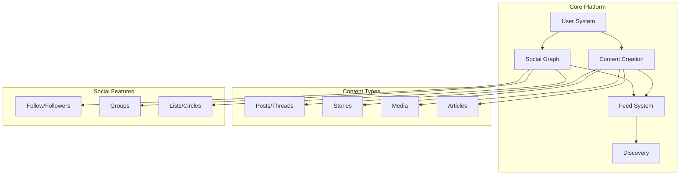
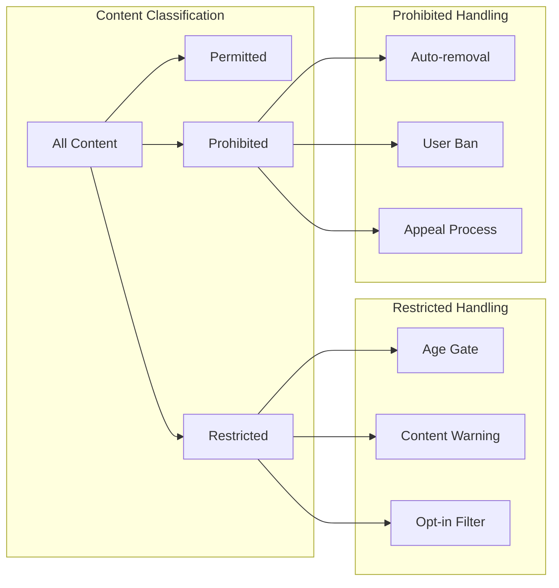
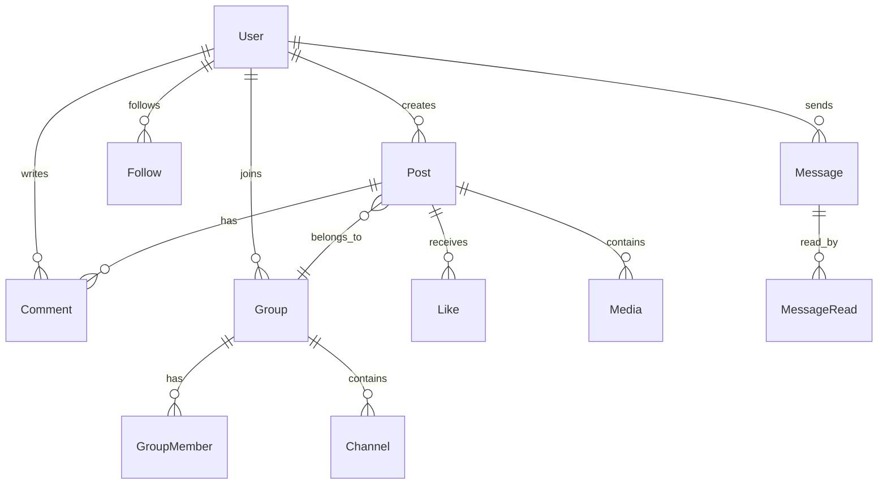
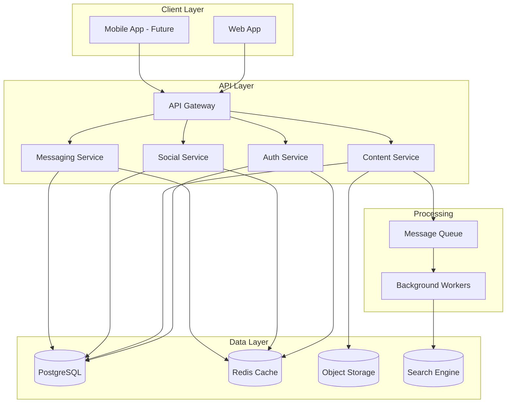
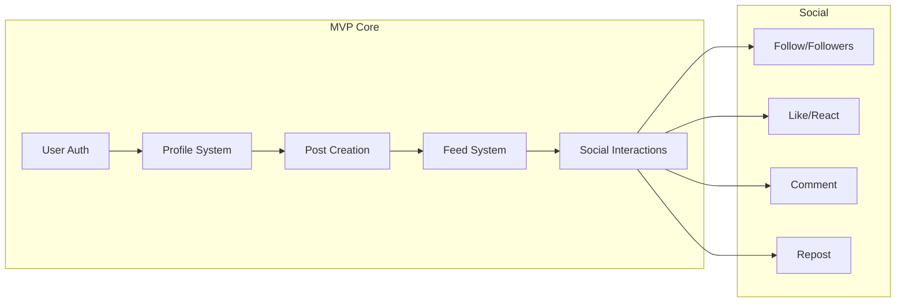

# SalamHub - Social Media Platform
## "To Rule Them All!" - Comprehensive Feature Proposal

---

## Executive Summary

**SalamHub** is a next-generation social media platform that combines the best elements from successful platforms while emphasizing **free speech** and **Islamic moral values**. Open to everyone worldwide, the platform provides a safe, ethical, and engaging environment rooted in the Islamic principle of "Salam" (peace).

### Confirmed Platform Decisions

| Aspect | Decision |
|--------|----------|
| **Platform Name** | SalamHub (سلام هب) |
| **Target Audience** | Everyone, with Islamic values as foundation |
| **Content Moderation** | Strict enforcement with community oversight |
| **Monetization** | Donations and community funding |
| **Account Type** | Standard accounts (like Instagram/Facebook) |
| **DM Encryption** | End-to-end encrypted |
| **Default Language** | Arabic (initial target) |
| **Launch Strategy** | Local first, then global expansion |

---

## Part 1: Feature Analysis from Successful Platforms

### 1. Twitter/X Features

| Feature | Description | Priority | Notes |
|---------|-------------|----------|-------|
| **Real-time Feed** | Chronological + algorithmic timeline options | High | Core feature |
| **Threads** | Connected posts for storytelling | High | Essential for longer content |
| **Hashtags** | Topic categorization and discovery | High | Proven discovery mechanism |
| **Trending Topics** | Popular discussions visibility | Medium | Can be filtered for appropriateness |
| **Retweet/Repost** | Content amplification | High | With attribution |
| **Quote Posts** | Add commentary when sharing | High | Encourages discussion |
| **Bookmarks** | Save posts for later | Medium | Private saving |
| **Lists/Circles** | Curated user groups | Medium | For targeted sharing |
| **Spaces** | Live audio conversations | Low | Resource-intensive |
| **Communities** | Topic-based groups | Medium | Similar to subreddits |

### 2. Facebook Features

| Feature | Description | Priority | Notes |
|---------|-------------|----------|-------|
| **Groups** | Community spaces around interests | High | Private/public options |
| **Events** | Create and manage events | High | Community building |
| **Marketplace** | Buy/sell platform | Medium | Moderation needed |
| **Reactions** | Multiple emoji responses | Medium | More expressive than likes |
| **Long-form Posts** | No character limit option | High | For detailed content |
| **Photo Albums** | Multiple images per post | High | Visual storytelling |
| **Memories** | Past content resurfacing | Low | Nostalgia feature |
| **Pages** | Business/creator profiles | Medium | For organizations |
| **Messenger** | Direct messaging | High | With group chat support |

### 3. Instagram Features

| Feature | Description | Priority | Notes |
|---------|-------------|----------|-------|
| **Stories** | 24-hour ephemeral content | High | Popular format |
| **Reels/Short Video** | Short-form video content | High | High engagement |
| **Filters** | Photo/video enhancement | Medium | Creative expression |
| **Explore Page** | Content discovery | High | Algorithmic recommendations |
| **IGTV/Long Video** | Longer video content | Medium | For educational content |
| **Direct Messages** | Private messaging | High | Already covered |
| **Live Streaming** | Real-time video broadcast | Medium | For events and discussions |
| **Shopping** | In-app purchases | Low | Monetization option |
| **Guides** | Curated content collections | Medium | Educational use |

### 4. LinkedIn Features

| Feature | Description | Priority | Notes |
|---------|-------------|----------|-------|
| **Professional Profiles** | Career-focused profiles | Medium | Optional feature |
| **Job Board** | Employment listings | Low | Future consideration |
| **Articles** | Long-form publishing | High | Knowledge sharing |
| **Endorsements** | Skill verification | Low | Professional context |
| **Professional Groups** | Industry communities | Medium | Knowledge exchange |

### 5. Reddit Features

| Feature | Description | Priority | Notes |
|---------|-------------|----------|-------|
| **Subreddits/Communities** | Topic-specific forums | High | Already in Groups |
| **Upvote/Downvote** | Community curation | High | Quality signal |
| **Awards** | Recognition system | Medium | Positive reinforcement |
| **Moderation Tools** | Community self-governance | High | Essential for scale |
| **Wiki** | Community knowledge base | Medium | Educational value |
| **Polls** | Community voting | High | Engagement feature |

### 6. Telegram Features

| Feature | Description | Priority | Notes |
|---------|-------------|----------|-------|
| **Channels** | One-to-many broadcasting | High | For creators and organizations |
| **Large Groups** | Up to 200k members | Medium | Scalability |
| **Bots** | Automated interactions | Medium | API for developers |
| **Secret Chats** | End-to-end encrypted | High | Privacy focus |
| **File Sharing** | Large file support | Medium | Up to 2GB files |
| **Voice Chats** | Group voice calls | Medium | Community engagement |

### 7. YouTube Features

| Feature | Description | Priority | Notes |
|---------|-------------|----------|-------|
| **Video Hosting** | Long-form video | High | Core media type |
| **Playlists** | Curated video collections | Medium | Organization |
| **Live Streaming** | Real-time broadcast | Medium | Already covered |
| **Comments** | Discussion under videos | High | With threading |
| **Subscriptions** | Follow creators | High | Already in follow |
| **Monetization** | Creator revenue sharing | Medium | Sustainability |

### 8. Discord Features

| Feature | Description | Priority | Notes |
|---------|-------------|----------|-------|
| **Servers** | Community spaces | High | Similar to Groups |
| **Channels** | Topic organization | High | Within groups |
| **Roles** | User permissions | High | Community management |
| **Voice Channels** | Always-on audio | Medium | Community building |
| **Screen Sharing** | Collaborative feature | Low | Niche use |

---

## Part 2: Proposed Unified Feature Set

### Core Features (Phase 1)

### Feature Categories

#### A. User System
- [ ] User registration with email/phone
- [ ] Profile customization
- [ ] Privacy settings
- [ ] Account verification
- [ ] Multiple profile types: Personal, Business, Creator

#### B. Content Creation
- [ ] Text posts with rich formatting
- [ ] Thread creation
- [ ] Image posts with albums
- [ ] Video posts: short-form and long-form
- [ ] Stories: 24-hour ephemeral content
- [ ] Articles: long-form publishing
- [ ] Polls and surveys
- [ ] Voice notes

#### C. Social Graph
- [ ] Follow/Followers system
- [ ] Friend connections: mutual follow
- [ ] Groups: public, private, secret
- [ ] Lists/Circles for content targeting
- [ ] Block/Mute functionality

#### D. Feed System
- [ ] Chronological feed option
- [ ] Algorithmic feed option
- [ ] For You discovery feed
- [ ] Following feed
- [ ] Hashtag feeds
- [ ] Group feeds

#### E. Engagement
- [ ] Like/Reaction system
- [ ] Comments with threading
- [ ] Repost with quote option
- [ ] Bookmarks/Collections
- [ ] Share externally

#### F. Communication
- [ ] Direct messaging
- [ ] Group chats
- [ ] Voice messages
- [ ] Video calls: optional

#### G. Discovery
- [ ] Search: users, content, hashtags
- [ ] Explore page
- [ ] Trending topics
- [ ] Recommendations

#### H. Community & Moderation
- [ ] Community guidelines
- [ ] User reporting system
- [ ] Moderation tools
- [ ] Content warnings
- [ ] Age restrictions

---

## Part 3: Free Speech & Islamic Values Framework

### The Challenge

Balancing **free speech** with **Islamic moral values** requires a nuanced approach that:
1. Protects legitimate expression
2. Prevents harm and corruption
3. Respects diverse perspectives within Islamic jurisprudence
4. Provides transparency in moderation

### Proposed Framework

#### 1. Content Categories

#### 2. Content Policy Principles

**Permitted Content:**
- Religious discussions and debates: respectful
- Political discourse: within legal bounds
- Scientific and educational content
- Art and creativity: within moral bounds
- Personal opinions and experiences
- News and current events
- Business and commerce: halal

**Restricted Content: Requires Warning/Opt-in**
- Sensitive topics: death, illness, etc.
- Political content in certain regions
- Controversial religious debates
- Mature themes: non-explicit

**Prohibited Content:**
- Pornography and explicit sexual content
- Hate speech and incitement to violence
- Harassment and bullying
- Fraud and scams
- Illegal activities
- Blasphemy and religious mockery
- Promotion of haram activities: gambling, alcohol, etc.

#### 3. Moderation Approach

| Aspect | Approach | Rationale |
|--------|----------|-----------|
| **Transparency** | Clear, published guidelines | Users know the rules |
| **Consistency** | Standardized enforcement | Fair treatment |
| **Appeals** | Review process for decisions | Correct errors |
| **Graduated Response** | Warnings before bans | Education over punishment |
| **Community Input** | Advisory board for policy | Democratic participation |
| **AI + Human** | Automated detection + human review | Scale + nuance |

#### 4. User Controls

- **Content Filters:** Users can set sensitivity levels
- **Keyword Blocking:** Mute specific words/topics
- **Topic Preferences:** Customize feed content
- **Religious Content Settings:** Control religious content visibility
- **Family Mode:** Stricter filtering for younger users

#### 5. Islamic Values Integration

**Positive Features:**
- Prayer time reminders: optional
- Quran verse of the day: optional
- Islamic calendar integration
- Halal business directory
- Charity/donation integration
- Islamic knowledge sections

**Content Guidelines Based on Islamic Principles:**
- Prohibition of ghiba: backbiting
- Prohibition of namimah: slander
- Modesty in imagery
- Truthfulness in content
- Respect for all religions
- Protection of privacy

---

## Part 4: Technical Architecture Recommendations

### Technology Stack

| Layer | Technology | Rationale |
|-------|------------|-----------|
| **Frontend** | Next.js + React + TypeScript | Already in use, excellent DX |
| **Styling** | Tailwind CSS | Already in use, rapid development |
| **State Management** | Zustand or Redux Toolkit | Scalable, performant |
| **Backend** | Node.js + Express or Next.js API | Unified stack |
| **Database** | PostgreSQL + Redis | Relational + caching |
| **ORM** | Prisma | Type-safe, excellent DX |
| **File Storage** | AWS S3 or Cloudflare R2 | Scalable object storage |
| **Search** | Elasticsearch or Meilisearch | Full-text search |
| **Real-time** | Socket.io or Pusher | Live updates |
| **Message Queue** | Redis or RabbitMQ | Background jobs |
| **CDN** | Cloudflare | Global distribution |

### Database Schema Overview

### System Architecture

---

## Part 5: Implementation Phases

### Phase 1: Foundation
- [ ] User authentication system
- [ ] Profile creation and management
- [ ] Basic post creation: text, images
- [ ] Follow/Followers system
- [ ] Basic feed: chronological
- [ ] Database setup and migrations

### Phase 2: Core Social Features
- [ ] Comments and threading
- [ ] Likes/Reactions
- [ ] Reposts and quotes
- [ ] Bookmarks
- [ ] Hashtags
- [ ] User search

### Phase 3: Content Expansion
- [ ] Video uploads
- [ ] Stories feature
- [ ] Articles/Long-form
- [ ] Polls
- [ ] Media albums

### Phase 4: Community Features
- [ ] Groups system
- [ ] Group roles and permissions
- [ ] Group channels
- [ ] Events
- [ ] Community moderation tools

### Phase 5: Communication
- [ ] Direct messaging
- [ ] Group chats
- [ ] Voice messages
- [ ] Notifications system

### Phase 6: Discovery & Growth
- [ ] Algorithmic feed
- [ ] Explore page
- [ ] Trending topics
- [ ] Content recommendations
- [ ] SEO optimization

### Phase 7: Advanced Features
- [ ] Live streaming
- [ ] Audio spaces
- [ ] Marketplace
- [ ] Creator monetization
- [ ] API for developers

---

## Part 6: Confirmed Decisions

| Question | Decision |
|----------|----------|
| **Target Audience** | Everyone, with Islamic values as foundation |
| **Geographic Focus** | Local launch first, then global expansion |
| **Content Moderation** | Strict enforcement with community oversight |
| **Monetization** | Donations and community funding |
| **Privacy** | End-to-end encryption for direct messages |
| **Anonymity** | Standard accounts like Instagram/Facebook (no anonymous accounts) |
| **Age Restrictions** | To be defined in detailed policy |
| **Multi-language** | Arabic as default, expand to other languages later |

---

## Part 7: MVP Feature Prioritization

### Must-Have for Initial Launch

### MVP Feature List

| Feature | Priority | Description |
|---------|----------|-------------|
| User Registration | P0 | Email/phone signup with verification |
| User Login | P0 | Secure authentication with JWT |
| Profile Creation | P0 | Basic profile: name, bio, avatar |
| Profile Editing | P0 | Update profile information |
| Text Posts | P0 | Create text-only posts |
| Image Posts | P0 | Single image upload per post |
| Feed - Following | P0 | Chronological feed of followed users |
| Feed - For You | P1 | Algorithmic discovery feed |
| Follow System | P0 | Follow/unfollow users |
| Like/Reaction | P0 | React to posts |
| Comments | P0 | Comment on posts with threading |
| Repost | P1 | Share others posts |
| Hashtags | P1 | Topic categorization |
| Search | P1 | Search users and content |
| Notifications | P1 | Activity notifications |
| Direct Messages | P2 | Private messaging with E2E encryption |
| Bookmarks | P2 | Save posts for later |
| Groups | P2 | Basic community creation |

---

## Next Steps

1. ✅ Review and refine this proposal
2. [ ] Prioritize features for MVP
3. [ ] Design detailed database schema
4. [ ] Create UI/UX wireframes
5. [ ] Set up development environment
6. [ ] Begin Phase 1 implementation

---

*Document Version: 1.1*
*Created: 2026-02-20*
*Updated: 2026-02-20*
*Status: Approved for Planning*
